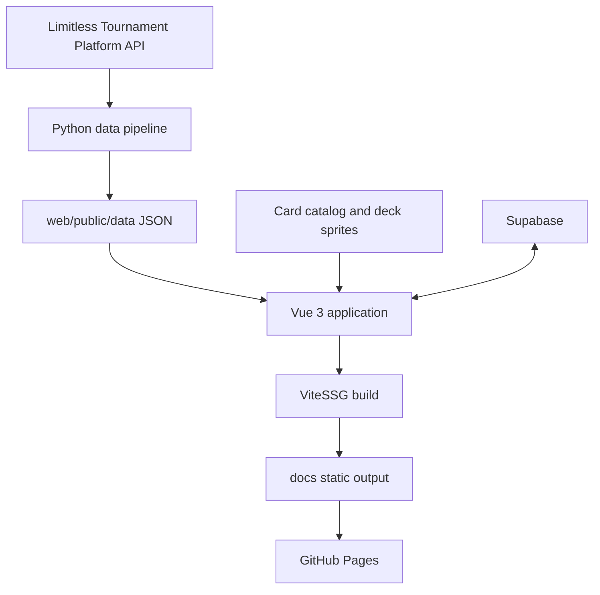

# BattleTowerMeta 專案總覽

> 更新日期：2026-07-03
> 目前遊戲版本：B3b - Everyday Wonders
> 用途：新協作者交接、功能開發，以及大型視覺改版前的共同基準

## 1. 專案定位

BattleTowerMeta 是一個以 Pokemon TCG Pocket 競技環境為核心的資料網站。

網站從 Limitless Tournament Platform 取得公開賽事資料，經 Python pipeline 整理後，由 Vue 3 + ViteSSG 建立靜態頁面並部署到 GitHub Pages。登入、個人排位記錄、交易與牌組討論等互動功能則由 Supabase 提供。

BattleTowerMeta 不是單純的勝率排行榜。它同時呈現：

- 牌組 Tier List 與相對分級
- 牌組使用率、Top 32 表現與加權成績
- 勝率矩陣與具體勝、負、和場數
- 熱門牌組排行與牌組詳情
- 最佳範例牌組與卡片投入率
- 泛用卡片圖鑑
- 賽事列表與單場賽事報告
- 玩家排名、玩家履歷與地區排名
- 排位記錄、交易與牌組討論
- 牌組 PNG、Tier List PNG 與創作者素材 ZIP

## 2. 目前狀態快照

以下數字是 2026-07-03 資料更新後的快照，之後會隨每日 pipeline 改變：

| 項目 | 目前狀態 |
| --- | ---: |
| 收錄賽事 | 1,532 |
| 全部參賽紀錄 | 313,619 |
| Top 32 樣本位置 | 47,572 |
| 牌組 sprite PNG | 363 |
| 卡片圖 | 3,512 |
| 目前卡包 | B3b - Everyday Wonders |
| B3b 卡片數 | 106 |

核心 production URL：

```text
https://www.battletowermeta.com/
```

## 3. 技術棧

| 層級 | 技術 |
| --- | --- |
| Frontend | Vue 3、`<script setup>`、TypeScript |
| Routing | Vue Router |
| Static generation | Vite 7、ViteSSG |
| Data pipeline | Python 3 |
| Hosting | GitHub Pages |
| CI/CD | GitHub Actions |
| Interactive backend | Supabase |
| 圖片匯出 | `html-to-image` |
| ZIP 產生 | 瀏覽器端 ZIP builder，主要集中於 `DeckProfile.vue` |
| Analytics | Google Analytics |
| Browser QA | Playwright / Codex in-app browser |

前端 package 定義在：

```text
web/package.json
```

## 4. 三層架構



可以把整個專案理解為三層：

1. 資料層：Limitless API -> Python scripts -> runtime JSON
2. 靜態網站層：Vue views -> ViteSSG -> `docs/`
3. 互動層：Supabase auth/tables -> 排位、交易、討論

大型視覺改版原則上應集中在第二層，避免改動第一層的統計語意與第三層的資料契約。

## 5. Repository 地圖

```text
BattleTowerMeta/
  .github/
    workflows/
      daily.yml                    # 每日資料更新、build、Pages 部署

  scripts/
    fetch_raw_data.py              # 抓取賽事與 raw data
    process_data.py                # 產生全域統計
    build_precomputed_views.py     # 預先計算熱門牌組與牌組詳情
    build_tournament_pages.py      # 產生單場賽事頁 JSON
    extract_tournament_players.py  # 產生賽事玩家資料

  supabase/
    schema.sql                     # Supabase schema、RLS、trigger、view

  web/
    package.json
    vite.config.ts                 # Vite config，build 到 ../docs
    public/
      data/                        # runtime JSON，由 pipeline 產生
      fonts/                       # Source Han Sans、D-DIN
    src/
      main.ts                      # ViteSSG 入口、GA、靜態 route discovery
      routes.ts                    # zh/en 路由表
      App.vue                      # 全站 topbar、mobile sidebar、footer
      layouts/Layout.vue           # RouterView 與 html lang
      responsive.css               # 最小全域 responsive reset
      style.css                    # Vite starter 遺留，目前沒有被 main.ts 匯入
      assets/
        theme.css                  # 全域顏色 token 與 body 背景
        fonts.css                  # 字體與字體 token
        pokemonNames.ts            # Pokemon / 牌組名稱本地化
        deck-icons/                # 牌組 sprite PNG
        deck-disks/                # 卡片數量 badge 圖
        limitless_dump/            # 卡片 catalog JSON 與 WebP
      components/                  # Supabase 與互動功能元件
      lib/                         # 資料讀取、統計、分級、Supabase
      views/                       # 主要 route 頁面

  docs/                            # build 產物，不要手動修改
  PROJECT_OVERVIEW.md              # 本文件
```

## 6. App 入口與路由

入口流程：

```text
web/src/main.ts
  -> import theme.css / fonts.css / responsive.css
  -> ViteSSG(App, routes)
  -> client 端初始化 Google Analytics
  -> build 時讀 tier.json，加入所有牌組詳情靜態 routes
```

路由使用語言前綴。中文與英文共用同一批 Vue views：

```text
/zh
/zh/tier-list
/zh/tournaments
/zh/tournaments/:id
/zh/top-decks
/zh/top-decks/:deckKey
/zh/top-cards
/zh/battle-hub
/zh/player-ranking
/zh/player-ranking/:playerSlug
/zh/country-ranking

/en/... 對應相同頁面
```

語言通常由 URL 的第一段推斷：

```ts
route.path.split("/")[1]
```

目前沒有使用全域 i18n plugin。多數頁面的中英文文字都放在該 Vue 檔案內的 `messages`、`labels` 或 `ui` 物件。

視覺改版若改動導覽、標題、空狀態或按鈕文字，必須同時檢查 `/zh` 與 `/en`。

## 7. 主要頁面地圖

| 頁面 | 核心內容 | 視覺改版風險 |
| --- | --- | --- |
| `Home.vue` | 首頁入口、牌組 ZIP、完整素材 ZIP | 會以隱藏的 `DeckProfile` 啟動 creator pack |
| `TierList.vue` | 使用率、Tier lanes、勝率矩陣、PNG 匯出 | sticky matrix、桌面與 mobile 是不同呈現方式 |
| `Tournaments.vue` | 賽事列表、版本與時間篩選 | 資料密度、長列表、mobile table |
| `TournamentReport.vue` | 單場賽事摘要、Top 32 牌表 | 名次、牌組 sprite、報表密度 |
| `TopDecks.vue` | 牌組排名、分級、趨勢與篩選 | 欄位多、桌面 table 與 mobile rows |
| `DeckProfile.vue` | 牌組詳情、範例牌組、投入率、對局、下載 | 全站最複雜頁面，匯出 DOM 與 UI 高度耦合 |
| `TopCards.vue` | 卡片圖鑑、投入率、1 張/2 張比例 | 大量卡圖、篩選器、responsive card grid |
| `PlayerRanking.vue` | 玩家排行榜 | 高密度排名 table |
| `PlayerProfile.vue` | 玩家成績、牌組與賽事履歷 | 多組統計 panel 與時間資料 |
| `CountryRanking.vue` | 地區排行榜 | 國旗、長名稱、mobile 排版 |
| `BattleHub.vue` | 排位記錄與互動功能容器 | 內部主要由 components 負責 |

## 8. 共用 frontend libraries

`web/src/lib/`：

| 檔案 | 職責 |
| --- | --- |
| `publicData.ts` | cached fetch、raw standings、pairings、runtime JSON |
| `playerEntries.ts` | 玩家資料型別、遊戲版本、時間與 Top Cut filters |
| `pairingResolver.ts` | 對局雙方、牌組與賽果解析 |
| `deckTier.ts` | Tier 分數、EMA 與 SS/SSS 判定 |
| `precomputedViews.ts` | 讀取 Top Decks / Deck Profile 預運算資料 |
| `rankTracker.ts` | 排位升降、連勝與對局記錄計算 |
| `supabase.ts` | Supabase client、登入狀態、profile |
| `interactive.ts` | rank logs、trade posts、deck discussions |
| `countryNames.ts` | 地區名稱本地化 |
| `analytics.ts` | GA 初始化與 page view |

視覺改版時應盡量保留這些 module 的 public interface。若只是改 layout、顏色與元件外觀，不應同時重寫資料計算。

## 9. 目前視覺系統

### 9.1 全域樣式入口

實際被 `main.ts` 匯入的全域 CSS：

```text
web/src/assets/theme.css
web/src/assets/fonts.css
web/src/responsive.css
```

`web/src/style.css` 是 Vite starter 遺留檔，目前沒有被 `main.ts` 匯入，不應把新設計 token 放進去。

### 9.2 現有 design tokens

`theme.css` 目前只有少量 token：

```css
--accent: #00afef;
--accent-hover: #0096cf;
--bg: #071521;
--surface: #0b2235;
--text: #eaf6ff;
--muted: #9fb3c8;
--border: #18364d;
```

目前大量顏色、陰影、圓角、間距和 breakpoint 仍直接寫在各 Vue SFC 裡。

大型視覺改版建議先擴充 token，而不是逐頁換 hard-coded color：

```text
color:
  canvas / surface / elevated / overlay
  text-primary / text-secondary / text-muted
  border-subtle / border-strong
  accent / positive / negative / warning / neutral

space:
  4 / 8 / 12 / 16 / 24 / 32

radius:
  control / panel / card / modal

shadow:
  panel / floating / focus

size:
  page-max / topbar-height / control-height / icon-button
```

### 9.3 字體

字體在 `web/src/assets/fonts.css`：

- 英文 display：Anton
- 中文：Source Han Sans / Noto Sans TC fallback
- 數字：D-DIN Condensed / D-DIN

`.mono` 用於比例、場數、排名與其他需要 tabular numbers 的數字。

視覺改版應保留數字欄位的 tabular alignment，否則排名、勝率與矩陣會變得難以掃讀。

### 9.4 全站 shell

`App.vue` 負責：

- sticky topbar
- desktop navigation
- mobile menu button
- mobile sidebar / overlay
- account menu
- 中英文切換
- 1400px 內容最大寬度
- footer

目前主要 breakpoint：

- `1100px`：縮小 topbar spacing / nav font
- `760px`：隱藏 desktop nav，改用 sidebar

### 9.5 頁面樣式分布

多數頁面使用大型 `<style scoped>`，視覺規則高度分散：

| 檔案 | 約略行數 | 改版注意 |
| --- | ---: | --- |
| `DeckProfile.vue` | 8,700+ | UI、匯出 HTML、ZIP、資料整合全部在同檔 |
| `TierList.vue` | 3,600+ | Tier lanes、matrix、mobile matrix、匯出 |
| `TopCards.vue` | 2,400+ | card atlas 與卡圖 grid |
| `TopDecks.vue` | 2,300+ | desktop/mobile ranking |
| `Tournaments.vue` | 1,600+ | filters、table、mobile |
| `TournamentReport.vue` | 1,400+ | tournament report |
| `PlayerProfile.vue` | 1,400+ | 多種個人統計 panel |

這代表大型改版若直接逐頁覆蓋 CSS，很容易形成更多重複規則。較穩定的方向是先建立共用視覺 primitives，再逐頁替換。

### 9.6 現有 responsive breakpoints

頁面內目前混用：

```text
480 / 520 / 560 / 640 / 680 / 720 / 760
820 / 900 / 980 / 1080
1280 / 1320 / 1380
```

大型改版應整理成少量共享 breakpoint，但不能一次刪掉現有規則。先逐頁確認實際 layout，再合併相近 breakpoint。

## 10. 建議建立的 UI primitives

目前沒有完整共用 design system。視覺改版第一階段可考慮建立：

```text
components/ui/
  AppButton.vue
  IconButton.vue
  AppSelect.vue
  SegmentedControl.vue
  FilterBar.vue
  StatBlock.vue
  DataPanel.vue
  EmptyState.vue
  LoadingState.vue
  DeckIdentity.vue
  TierBadge.vue
  SpriteStack.vue
```

優先抽取條件：

- 至少在三個頁面重複
- 視覺與互動契約一致
- 不把頁面特有的統計邏輯塞進共用元件

不要為了「元件化」一次拆完所有大型頁面。先抽最穩定的視覺單位，例如 button、select、panel header、tier badge、sprite stack。

## 11. 資料 pipeline

```text
1. scripts/fetch_raw_data.py
   -> tournaments.json
   -> raw/<tid>/{details,standings,pairings}.json
   -> excluded_tournaments.json

2. scripts/process_data.py
   -> tier.json
   -> players.json
   -> player_entries.json
   -> matchups.json
   -> meta.json

3. scripts/build_precomputed_views.py
   -> precomputed/top_decks.json
   -> precomputed/deck_profiles/*.json

4. scripts/build_tournament_pages.py
   -> tournament-pages/*.json
   -> tournament-pages/manifest.json

5. scripts/extract_tournament_players.py
   -> tournament_players_final.json

6. cd web && npm run build
   -> docs/
```

`web/public/data/` 是生成資料，不應為了 UI 手動修改。

特殊規則賽事 `6a021c2313f957d6d4b45d8b` 已在以下兩個檔案明確排除：

```text
scripts/fetch_raw_data.py
scripts/process_data.py
```

## 12. 牌組分級公式

BattleTowerMeta 的 Tier 是同一篩選範圍內的相對分數，不是單純勝率排名。

### 12.1 原始三項訊號

- 40%：Top 32 次數
- 50%：加權名次分
- 10%：Top 32 占比

名次分：

| 名次 | 分數 |
| --- | ---: |
| 1st | 10 |
| 2nd | 8 |
| 3rd-4th | 6 |
| 5th-8th | 4 |
| 9th-16th | 2 |
| 17th-32nd | 1 |

### 12.2 EMA

目前額外加入 15% EMA 趨勢分：

```text
最終分數 =
  34.0% 標準化 log(Top 32 次數)
  + 42.5% 標準化 log(加權名次分)
  + 8.5% 標準化 log(Top 32 占比)
  + 15.0% 標準化 EMA 趨勢
```

前三項仍維持原本 40:50:10 的內部比例，只是整體縮成 85%，把 15% 留給近期趨勢。

每日 EMA signal：

```text
0.4 * log1p(當日 Top 32 次數)
+ 0.5 * log1p(當日加權名次分)
+ 0.1 * log1p(當日 Top 32 占比)
```

EMA 半衰期是 7 天，可由環境變數調整：

```text
TIER_EMA_HALF_LIFE_DAYS
```

前端與預運算版本必須保持一致：

```text
web/src/lib/deckTier.ts
scripts/build_precomputed_views.py
```

### 12.3 Tier 門檻

| 分數 | Tier |
| --- | --- |
| `<= 0.10` | F |
| `> 0.10` 且 `<= 0.30` | E |
| `> 0.30` 且 `<= 0.50` | D |
| `> 0.50` 且 `<= 0.70` | C |
| `> 0.70` 且 `<= 0.80` | B |
| `> 0.80` 且 `<= 0.90` | A |
| `> 0.90` | S |

只有第一名可升為 SS / SSS：

- 第一名領先第二名 `> 0.05`：SS
- 第一名領先第二名 `> 0.10`：SSS

勝率與對局優劣不直接計入 Tier 分數。

## 13. 勝率矩陣語意

目前版本矩陣刻意分成兩個概念：

1. 顯示哪些牌組：跟隨目前版本「近 7 天」Tier / Top Decks 的前 10 副牌
2. 儲存的勝、負、和與勝率：使用目前版本的全期間對局

也就是：

```text
matrix axis decks = current version + past 7 days
matrix matchup records = current version + all available days
```

`TierList.vue` 另有自選牌組欄位。使用者選擇的額外牌組會加入矩陣 row / column，因此改版時不能只設計固定 10 x 10 的視覺。

相關預運算：

```text
scripts/build_precomputed_views.py
  MATRIX_DISPLAY_DECK_LIMIT = 10
  extra_matchup_keys
```

視覺改版不能改變矩陣數字的統計範圍，也不能讓自選牌組在資料更新後消失。

## 14. Card 與 deck assets

### 14.1 牌組 sprites

```text
web/src/assets/deck-icons/
web/src/assets/deck-icons/manifest.json
```

牌組名稱會拆成 sprite keys。新增版本後若有新 Pokemon / form，需要補圖並更新 manifest。

### 14.2 卡片 catalog

```text
web/src/assets/limitless_dump/limitless_sets.json
web/src/assets/limitless_dump/limitless_cards.json
web/src/assets/limitless_dump/images/<set>/*.webp
```

目前 catalog 已包含 B3b。

### 14.3 卡片數量 badge

```text
web/src/assets/deck-disks/3.png  # 1 張
web/src/assets/deck-disks/4.png  # 2 張
```

數量數字使用 D-DIN。改卡片比例時要確認 badge、百分比和卡面不重疊。

## 15. 圖片與 ZIP 匯出

匯出功能不是普通截圖，它依賴特定 DOM、固定尺寸與 CSS：

- `TierList.vue`：Tier List PNG
- `DeckProfile.vue`：牌組 panel PNG
- `DeckProfile.vue`：creator pack decklists
- `DeckProfile.vue`：完整 creator pack ZIP
- `Home.vue`：啟動快速牌組 ZIP / 完整素材 ZIP

目前重要版面契約：

- DeckProfile 畫面上的「範例牌組」桌面為 5 張一行
- 900px 以下為 4 張一行
- 720px 以下為 2 張一行
- 匯出的 decklist 圖固定為 4 張一行
- 匯出圖只保留牌組本體，不顯示頁面上方的小字

改動以下 class 前要同時測試網頁和輸出 PNG：

```text
decklist-shell--sample
cardsGrid--profile
export-sample-panel
export-sample-grid
export-card-groups
```

`DeckProfile.vue` 內也直接產生 creator pack 的 HTML、CSV、JSON 與圖片。視覺改版不應假設所有輸出都只由 Vue template 控制。

## 16. Supabase 互動層

Supabase 用於互動功能，不是公開賽事統計的主要資料來源。

主要資料：

- `profiles`
- `rank_logs`
- `trade_posts`
- `deck_discussions`
- `rank_matchup_rollups`

主要元件：

- `TopbarAccountMenu.vue`
- `BattleHubAuthPanel.vue`
- `RankTrackerPanel.vue`
- `TradeHubPanel.vue`
- `DeckDiscussionPanel.vue`

環境變數：

```text
VITE_SUPABASE_URL
VITE_SUPABASE_ANON_KEY
VITE_GA_MEASUREMENT_ID
```

視覺改版要保留登入、loading、empty、error、disabled 與未授權狀態，不要只設計有資料的理想畫面。

## 17. GitHub Actions 與部署

Workflow：

```text
.github/workflows/daily.yml
```

觸發方式：

- push 到 `main`
- 每日 UTC 22:00，即香港時間 06:00
- manual `workflow_dispatch`

正常流程：

```text
checkout with Git LFS
-> Python data pipeline
-> commit web/public/data back to main with [skip ci]
-> npm ci
-> ViteSSG build to docs/
-> upload Pages artifact
-> deploy GitHub Pages
```

GitHub Actions 會自動產生資料 commit，因此推送前必須先 fetch，再 rebase 或 fast-forward。

## 18. 常用指令

### 18.1 檢查狀態

本機 Git LFS filter 偶爾會讓普通 status 出錯，使用：

```powershell
git -c filter.lfs.process= -c filter.lfs.required=false status --short --branch
```

### 18.2 Dev server

```powershell
cd web
npm.cmd run dev -- --host 127.0.0.1 --port 5174
```

### 18.3 Production build

```powershell
cd web
npm.cmd run build
```

### 18.4 本地資料更新

```powershell
$env:PYTHONUTF8='1'
$env:POCKET_GAME_ID='POCKET'
$env:UNLIMITED_DAYS='false'
$env:DAYS_BACK='30'
$env:MIN_PLAYERS='64'

python scripts/fetch_raw_data.py
python scripts/process_data.py
python scripts/build_precomputed_views.py
python scripts/build_tournament_pages.py
python scripts/extract_tournament_players.py
```

## 19. 大型視覺改版建議順序

### Phase 0：建立 baseline

改 code 前先保存：

- 正式站 desktop screenshots
- 正式站 mobile screenshots
- Tier List PNG
- DeckProfile PNG
- 快速 decklists ZIP 範例
- creator pack ZIP 範例

建議 baseline URL：

```text
/zh
/zh/tier-list
/zh/tournaments
/zh/top-decks
/zh/top-cards
/zh/battle-hub
/zh/player-ranking
/zh/country-ranking
/zh/top-decks/<current-deck-key>
/zh/tournaments/<recent-tournament-id>
```

### Phase 1：定義 design tokens

先處理：

- 色彩層級
- 字體 scale
- spacing
- border / radius
- shadow
- control height
- page width
- breakpoint policy

這一階段不重排複雜頁面。

### Phase 2：改全站 shell

優先改：

- `App.vue`
- topbar
- desktop navigation
- mobile sidebar
- account menu
- page container
- footer

完成後同時檢查中英文 nav 是否能完整容納。

### Phase 3：建立共用 primitives

先從 button、select、filter bar、panel header、tier badge、sprite stack 開始。

### Phase 4：改一般資料頁

建議順序：

1. Home
2. Tournaments
3. PlayerRanking
4. CountryRanking
5. PlayerProfile
6. TournamentReport

### Phase 5：改核心 meta 頁

建議順序：

1. TopDecks
2. TopCards
3. TierList
4. DeckProfile

`DeckProfile` 最後處理，因為它同時承擔最多資料與匯出責任。

### Phase 6：改互動頁

最後統一：

- BattleHub
- RankTracker
- TradeHub
- DeckDiscussion
- auth states

### Phase 7：匯出與 regression

逐一驗證 PNG / ZIP、SSG build、正式站與 mobile。

## 20. 視覺驗證清單

### Desktop

- 1440 x 900
- 1280 x 720
- 寬螢幕 1920 x 1080

### Mobile

- 390 x 844
- 430 x 932

### 每頁都要檢查

- topbar / sidebar 沒有遮住內容
- 中文與英文文字不溢出
- icon、數字、百分比不 overlap
- 長玩家名、地區名、牌組名能換行或截斷
- loading / empty / error state 不會改變 layout 尺寸
- table 與 matrix 在窄畫面仍可理解
- focus、hover、active、disabled 狀態完整
- 圖片沒有破圖
- 沒有非預期水平捲動

### 核心頁特殊檢查

Tier List：

- Tier lane 比例協調
- 自選矩陣牌組仍存在
- sticky header / row header 正常
- 勝率、勝負和場數不重疊
- mobile matrix 可掃讀
- PNG 匯出正常

DeckProfile：

- 範例牌組 desktop 5 張一行
- 卡片數量 badge 不遮卡面
- 卡片投入率 pie chart 與 1x / 2x 數字對齊
- 最佳成績「套用」仍可改變範例牌組
- desktop、tablet、mobile 都沒有 panel overlap
- PNG 與兩種 ZIP 輸出正常

TopCards：

- card grid 比例一致
- 卡片圖、投入率、1x / 2x icon 不重疊
- B3b 與之後新版本卡圖可載入

## 21. 不要直接修改的內容

- `docs/`：build 產物
- `web/public/data/`：pipeline 產物
- `web/node_modules/.vite/deps/*`：本機 Vite cache
- `.vs/`、`scripts/.vs/`：本機 Visual Studio 資料

不要還原使用者或既有 dirty changes。

如果只做 UI：

- 不必重跑完整 Python pipeline
- 應執行 `npm.cmd run build`
- 應實際用瀏覽器檢查 desktop / mobile
- 涉及匯出 UI 時必須實際下載並檢查 PNG / ZIP

## 22. 已知架構債務

- 大量視覺規則散在 route-level SFC
- 多頁重複 button、select、panel、badge 樣式
- breakpoint 數量過多
- `DeckProfile.vue` 同時負責頁面、統計整合、匯出 HTML 與 ZIP
- 版本 marker 在多個頁面重複維護
- 中英文文案分散在各 view
- `web/src/style.css` 是未使用的 starter CSS
- 部分舊元件如 `HelloWorld.vue`、`pages/Dashboard.vue`、`router.ts` 可能是 scaffold 遺留，改版前應確認是否仍有引用

大型視覺改版可以順便改善前四項，但不建議同時重寫資料 pipeline、路由與 Supabase。

## 23. 新 chat 交接範本

```text
專案：BattleTowerMeta
路徑：C:\Users\user\Documents\GitHub\BattleTowerMeta

先讀 PROJECT_OVERVIEW.md。

狀態請使用：
git -c filter.lfs.process= -c filter.lfs.required=false status --short --branch

不要碰：
- web/node_modules/.vite/deps/*
- .vs/
- docs/
- 非本次任務產生的 dirty changes

Frontend：Vue 3 + TypeScript + ViteSSG
主要 UI：web/src/views/
全域 theme：web/src/assets/theme.css
全站 shell：web/src/App.vue
資料：web/public/data/
build：cd web; npm.cmd run build

目前任務：<填入視覺改版項目>
```
